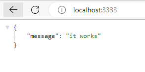

*\*Para seguir o tutorial abaixo é necessário ter o Node.js instalado e algum terminal disponível além de um editor de textos que pode ser o VS Code.*

Vamos começar abrindo o terminal e criar uma pasta com o nome fundamentos-node-js e em seguida acessá-la.

`mkdir fundamentos-node-js`

`cd fundamentos-node-js`

Agora já dentro da pasta do projeto vamos rodar um comando que irá inicializar o projeto.

`npm init -y`

O comando acima irá criar o arquivo package.json que é o arquivo que conterá as configurações do nosso projeto, como por exemplo dependências instaladas e scripts.

Nesse projeto vamos utilizar o Express que é um framework para aplicações web do Node.js que irá nos auxiliar em diversas situações, como por exemplo na criação de um servidor e gerenciamento de rotas, que é o que vamos fazer. Então para instalar o Express vamos rodar o comando abaixo, ainda dentro da pasta do projeto.

`npm install express`

Agora podemos abrir o VS Code e abrir a pasta do projeto. 

*\*Possivelmente pelo próprio terminal, dentro da pasta do projeto, você conseguirá abrir o VS Code já dentro da pasta do projeto com o comando* `code .`

Você irá observar que agora além do arquivo package.json temos também o package-lock.json e a pasta node_modules. O package-lock.json é apenas um arquivo de mapeamento do package.json e não devemos mexer nele. A pasta node_modules é a que contém as dependências instaladas que no momento tem todas as dependências que o Express precisa para executar.

Vamos começar criando uma pasta src e dentro dessa pasta vamos criar o arquivo index.js. A pasta src é criada apenas porque é uma boa prática manter nosso código dentro de uma pasta source, no caso src, e mantendo fora arquivos de configuração, dependências, etc.

Agora dentro de index.js vamos escrever o seguinte código e salvar em seguida.

```javascript
const express = require('express')

const app = express()

app.get('/', (request, response) => {
  response.json({ message: 'it works' })
})

app.listen(3333)
```

O que fizemos no código?

1. Criamos uma constante express que irá receber todo o framework express através do require()
2. Criamos uma constante app que recebe a função express()

   O express() é uma função que o Express disponibiliza para facilitar a execução de diversas funcionalidades, como por exemplo o gerencimento de rotas que fizemos. Isso significa que a partir de agora tudo o que formos executar irá partir de app.
3. Invocamos o método get() a partir de app

   O método get() é um método que é utilizado para obter uma resposta, que no nosso caso é uma simples mensagem. O método get() recebe dois argumentos: o primeiro é a rota que no nosso exemplo é a rota '/' que é a rota raiz. Isso significa que ao acessarmos no navegador localhost:3333/ será utilizado esse método que estamos criando. O segundo parâmetro do get() é uma função de callback. Essa função recebe dois argumentos: request e response. O request é o que vem na requisição podendo ser um header param, query param, route param ou body param. Não faremos nada com o request nesse exemplo. O response é a resposta que daremos a quem fez a requisição e no nosso exemplo usamos o método json() com um objeto como argumento. Essa é a resposta que quem fez a requisição verá.
4. Invocamos o método listen() a partir de app

   Enviamos como argumento do método listen() a porta que nossa aplicação irá utilizar. No exemplos utilizamos a porta 3333. Isso significa que nossa aplicação será acessada a partir do endereço localhost:3333

Então agora podemos rodar nossa aplicação com o seguinte comando

node src/index.js

O terminal não dará nenhuma resposta, porque também não configuramos nenhuma, ele apenas irá ficar parado. Então podemos abrir o navegador e acessar o endereço localhost:3333 para vermos a resposta.

